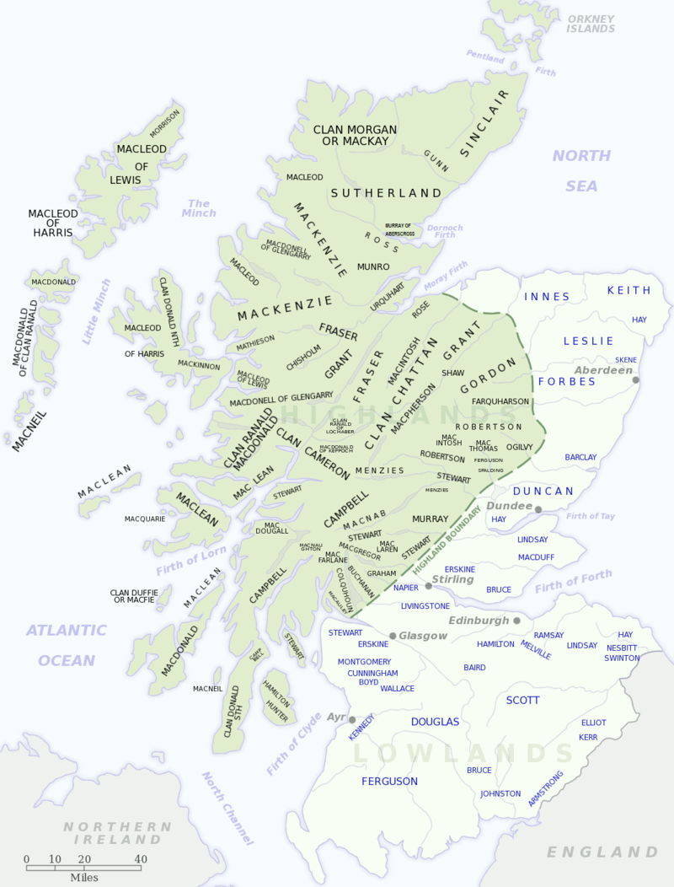

```{r setup, include=FALSE}
knitr::opts_chunk$set(echo = FALSE, warning = FALSE, message = FALSE)
# library(qrcode)
# png(filename="images/00_qrcode.png", width = 200, height = 200)
# qrcode_gen("https://github.com/agricolamz/2020.03.26_HSE_Dorian_variation/raw/master/2020.03.26_HSE_Dorian_variation.pdf")
# dev.off()
library(tidyverse)
```

# \color{colorwhite} Nancy Currier Dorian

## Nancy Currier Dorian (1936)

* 1958 B.A. --- Connecticut College for Women (the major field: German)
* 1961 M.A. --- University of Michigan (Linguistics)
* 1965 Ph.D. --- University of Michigan (Linguistics)
* Employment: Bryn Mawr College, University of Pennsylvania, University of Kiel. Now she is a Professor Emeritus of Linguistics in German & Anthropology Bryn Mawr College
* She has several awards for her Gaelic studies
* She wrote 6 books (we are reading the fifth) and about 70 articles
* Fieldwork
    * Gaelic (1965 2 m.; 1967 3 m.; 1968 4 m.; 1972 1 m.)
    * German, Berks County Pennsylvania (1976--83)
    * Disability status precluded on-site fieldwork after 1983. Fieldwork with East Sutherland Gaelic resumed, by tape recording and long-distance telephone, in 1990, and with Berks County Pennsylvania German, by long-distance telephone, in 1994.

# \color{colorwhite} Investigating variation: The effects of social organization and social setting \pause We will discuss only chapters 2--5
  
## Languages of the UK
\centering
\vspace{-2.5mm}
\includegraphics[width=\linewidth]{images/01_gb_languages.png}

## East Sutherland Gaelic

This book is about **East Sutherland fisherfolk Gaelic**, a cluster of dialects that came into being in the early years of the XIX century. Now this dialect is present in fishing villages on the eastern coast of [Sutherland](https://en.wikipedia.org/wiki/Sutherland), especially in Brora, Golspie, and Embo.

```{r, fig.height=3.5, eval = FALSE}
library(sf)
gb <- read_sf("data/gb/")

gb %>%
  mutate(my_coloring = ifelse(name == "Scotland", TRUE, FALSE)) %>% 
  ggplot(aes(fill = my_coloring, color = my_coloring))+
  geom_sf(show.legend = FALSE)+
  scale_fill_manual(values = c("gray", "darkgreen"))+
  scale_color_manual(values = c("gray20", "darkgreen"))+
  annotate(geom = "rect", xmin = -6, xmax = -3, ymin = 57.6, ymax = 58.7, alpha = 0.1, color = "red")+
  #scale_color_manual(values = "darkgreen")+
  theme(panel.grid.major = element_line(color = gray(.5), 
                                                linetype = "dashed", 
                                                size = 0.3),
                panel.background = element_rect(fill = "aliceblue"))+
  labs(x = "", y = "") ->
  p1

tibble(place = c("Brora", "Golspie", "Embo"),
       lat = c(-3.85, -3.9771 , -3.98),
       lng = c(58.01, 57.973,57.9)) ->
  villages

gb %>% 
  filter(name == "Scotland") %>% 
  ggplot()+
  geom_sf() + 
  annotate(geom = "point", x = villages$lat, y = villages$lng, color = "red")+
  annotate(geom = "text", x = villages$lat+0.05, y = villages$lng, label = villages$place, hjust = 0)+
  coord_sf(xlim = c(-6, -3), ylim = c(57.6, 58.7))+
  theme(panel.grid.major = element_line(color = gray(.5), 
                                                linetype = "dashed", 
                                                size = 0.3),
                panel.background = element_rect(fill = "aliceblue"))+
  labs(x = "", y = "") ->
  p2

gridExtra::grid.arrange(p1, p2, nrow = 1)
```


## Scottish Gaelic and Scots according the 2011 census

* Scottish Gaelic (Celtic, [scot1245](https://glottolog.org/resource/languoid/id/scot1245)), [Highland English](https://en.wikipedia.org/wiki/Highland_English)
* Standard English
* Scots (Germanic, [scot1243](http://glottolog.org/resource/languoid/id/scot1243)), [Scottish dialect of English](https://en.wikipedia.org/wiki/Scottish_English)

\vspace{6.5cm}
\includegraphics[scale = 4.5]{images/02_scottish_gaelic_and_scots.png}


# \color{colorwhite} Chapter 2. The East Sutherland Fishing Communities

## Short history of Scotland (and England)

* 5th--7th centuries --- The Pictish and Scottish kingdoms were largely converted to Christianity by Irish-Scots missions (see [Celtic Christianity](https://en.wikipedia.org/wiki/Celtic_Christianity)).
* 843 -- foundation of **The Kingdom of Scotland** by Kenneth MacAlpin: merge of The Pictish and Scottish kingdoms.
* 1066 --- **Malcolm III** granted asylum to many Anglo-Saxons, who emigrated after the Norman conquest of England.
* 1124–-1153 --- during the reign of **King David I** there are several changes took place including Normanization of the Scottish government, and the introduction of feudalism through immigrant Norman and Anglo-Norman knights. The Normans who came to England adopted the [Gregorian Reforms](https://en.wikipedia.org/wiki/Gregorian_Reform), and soon began attacking the Scottish and Irish Gaelic world as spiritually backward.
* 1707 --- **Acts of Union**. After a long period of political instability in Scotland the Scottish Parliament and the English Parliament united to form the Parliament of Great Britain.

## Highland Clearances or the eviction of the Gaels

* Since their origin in the early Middle Ages, clans were the major social unit of the Highlands.
* The aristocratic House of Sutherland was in any case not indigenous but was the creation of early Norman power in Scotland. Extensive lands in what we now know as Sutherland were granted in the first half of the 12 century to a family closely associated with newly established Norman power.
* Always oriented to the south, the earls of Sutherland took wives almost exclusively from outside the Gaelic aristocracy and were frequently absent from the north for extended periods (in Edinburgh, after 1707 in London)
* **Highland Clearances** is the process of consolidating small landholdings into large-scale pastoral farms stocked with sheep that was started from 1760. The Gaels were displaced to the newly created crofting communities, where they were expected to be employed in industries such as fishing, quarrying or the kelp industry. This also caused a huge emigration (e. g. to Canada).

## Highland Clearances or the eviction of the Gaels

* Before the Highland Clearances nearly all people of eastern Sutherland-shire birth were mother-tongue speakers of Gaelic, most of them also Gaelic monolinguals. Functionaries connected with the House of Sutherland might be, like the aristocratic family itself, English monolinguals, and the clergy were by necessity bilinguals.
* Cattle had been the dominant animal in Highland, and Highlanders at this period had relatively little experience with sheep. Lowland farmers taking up the new sheep farms created by the evictions therefore brought their own English shepherds with them.
* As a result Gaelic population became:
    * separated from each other
    * settled on the small land near the coast (or emigrated)
    * therefore forced to fishery
    * therefore poor
    * therefore in a low social standing
    * therefore strong endogamy (until the end of the World War I)
    * segregated in Church (service in English and Gaelic) and in school

## Fishing as a way of life in East Sutherland

* Line fishing
    * **men** fish, pack and transport fish to the railhead
    * **women** smoke white fish, sell fresh and smoked fish directly to housewives and to the hotels
    * **children** help with bait gathering, collect bentgrass from the shore, collect pinecones for fish smoking, collect water from the nearest pump
    * **older girls** take care of their younger siblings
    * **older boys** were responsible for the animals \pause

* Herring fishing
    * **herring** unpredictability go wherever their own preferred food sources, but in most cases moved along the coasts from the norh to south.
    * **men** collectively bought larger boat and acquired secondhand from Scots-speaking fishermen; after the World War I British herring fishing boats were increaingly powered by steam and became expensive, so they signed on, usually singly, as hired hands with fishermen who speak Scots. Fishermen follow herring.
    * **adult women and girls** were hired out as herring gutters and packers and also migrated following herring.

## Who did Nancy Dorian work with?

Despite the fisherfolk had formed a separate group in each village and contacted with each other, their Gaelic was not uniform. It is impossible to know, how uniform the Gaelic spoken in the fishing communities was at the time of their resettlement. It is possible to conclude something from 1851 census and modern [clan names](https://en.wikipedia.org/wiki/Scottish_clan).

\centering


## Who did Nancy Dorian work with?

* Gaelic speakers constituted just 3.6% of Brora’s population (43), 4.6% of Golspie's population (54), 38% of Embo population
* By 1963, when N. Dorian start her research, no one from the Gaelic-speaking fishing communities still fished full-time for his livelihood, and in Brora and Golspie a scattering of people who had grown up in Lower Brora or the West End now lived in other parts of the villages.
* Most of the older speakers had been involved in the herring fishery in their young days, and only the youngest imperfect speakers in Brora and Embo had no direct experience the local line fishing.
* The equation between speaking the local Gaelic and being of fisherfolk descent still
held, but number of exogamic marriages was growing.
* Many speakers included an effort to reduce the number of obvious English loanwords. All speakers had some familiarity with more mainstream varieties of Gaelic via sermons, broadcasts, work experience in the fishing industry, and occasional interaction with non-local speakers settled in East Sutherland.

# \color{colorwhite} Chapter 3. Dimensions of Linguistics Variation in a Socioeconomically Homogeneous Population

## Different types of variation

* Geographically Based Variation (table 3.1 p. 68, in .pdf 91)
* Age-Related Variation (table 3.2 p. 71, in .pdf 94)
* Style-Related Variation

'when' is different during the performance of proverbs and rhymes

* There is **no Gender-Related Variation**:

> As a result, lack of enough material (most especially freely spoken material) from older Embo women makes it difficult in some cases to rule out gender as a factor in variant choice, though other cases in which gender is clearly not a signifi cant factor at least make it evident that gender is not routinely important to variant choice.

* Personally Patterned Variation (table 3.3 p. 77, in pdf 100)

* The Idiosyncratic Variant-Use Patterns of a Sibling Pair

> Despite a small-family background, a small difference in age, a thoroughly local life pattern, and long-continued use of Gaelic between them, the two showed what seemed to me a remarkable set of differences in their Gaelic usage.

# \color{colorwhite} Personal story

## 

|               | every Wednesday       | something acc          | more beautiful | cottage cheese  | rain    |
|---------------|-----------------------|------------------------|----------------|-----------------|---------|
| dict. | по среда́м             | чего-то        | краси́вее       | тво́рог, творо́г  | до[шть] |
| family        | по сре́дам             | чего-то        | красиве́е       | творо́г          | до[щ]   |
| generation    |  по сре́дам > по среда́м | чё-то, чего-то | краси́вее       | тво́рог > творо́г | до[шть] |
| colleagues    | по среда́м, по сре́дам  | чё-то, чего-то | краси́вее       | тво́рог > творо́г | до[шть] |
| me            | по среда́м            | чё-то, чего-то | краси́вее       | творо́г          | до[щ]   |

# References {.allowframebreaks}
